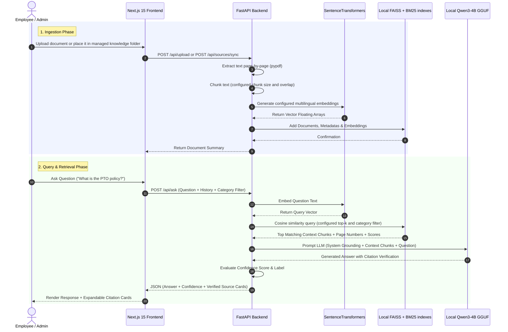

# DocMind System Architecture 🏛️

> This document contains the original prototype flow. The current offline
> ingestion implementation is documented in [P1 ingestion](p1-ingestion.md);
> FAISS/BM25 retrieval is documented in [P2 Fast retrieval](p2-fast-retrieval.md)
> and [P3 Quality retrieval](p3-quality-retrieval.md); local Qwen generation
> and citation validation are documented in [P4 local generation](p4-local-generation.md).

DocMind is designed as a modular, lightweight Retrieval-Augmented Generation (RAG) platform that enables enterprise teams to query internal PDF documents in natural language with source citation grounding.

---

## 📐 System Dataflow & Sequence Diagram

---

## 🛠️ Subsystem Responsibilities

### 1. Next.js 15 Frontend Layer
- **App Router (`app/`)**: Provides Server Side Rendering (SSR) and Client component isolation.
- **Tailwind Design System**: Custom glassmorphic dark theme, glowing indigo visual tokens, and responsive mobile-first views.
- **NextAuth.js**: Protects workspace routes (`/`, `/admin`) and handles user session state.
- **Client Components (`components/`)**:
  - `ChatWindow.tsx`: Manages multi-turn conversation state, category pill selection, prompt suggestions, and streaming responses.
  - `SourceCard.tsx`: Formats citation cards displaying filename, page number, similarity percentage, and chunk quotes.
  - `UploadPanel.tsx`: Handles PDF drag-and-drop file inputs, category selection, document indexing metrics, and deletion requests.

### 2. FastAPI Backend Layer
- **`main.py`**: Initializes ASGI app, handles CORS headers, mounts sub-routers, and provides `/health`.
- **`routes/chat.py`**: Exposes `POST /api/ask`. Coordinates configured dense/lexical retrieval, local LLM generation, and response serialization.
- **`routes/documents.py`**: Exposes `POST /api/upload`, `GET /api/docs`, and `DELETE /api/doc/{id}`.
- **`routes/sources.py`**: Exposes managed-folder sync/status endpoints. The
  hash manifest detects additions, edits, and removals without a filesystem
  watcher, which keeps the offline workstation flow explicit and predictable.
- **`services/embedder.py`**: Reads supported local formats, cleans whitespace, generates overlapping chunks with metadata (`doc_id`, `filename`, `category`, `page_number`, `chunk_index`), and embeds with the configured multilingual model.
- **`services/retriever.py`**: Retains the legacy pgvector adapter; the active path uses persistent FAISS/BM25 indexes with category metadata filtering.
- **`services/llm.py`**: Runs the local Qwen3-4B GGUF adapter, formats deterministic
  source labels, validates citations, enforces insufficient-evidence behavior,
  and scores answer confidence.

---

## 🔒 Security & Data Isolation
- **Data Persistence**: SQLite metadata, FAISS dense files, BM25 files, uploaded originals, and the managed-folder hash manifest live below the configured local data directory.
- **Zero Hallucination Grounding**: System prompts explicitly prevent LLM speculation outside retrieved chunks.
- **Network Boundaries**: In production, FastAPI API endpoints are restricted behind internal Docker network bridges or reverse proxies (Nginx / Hetzner VPS firewall).
