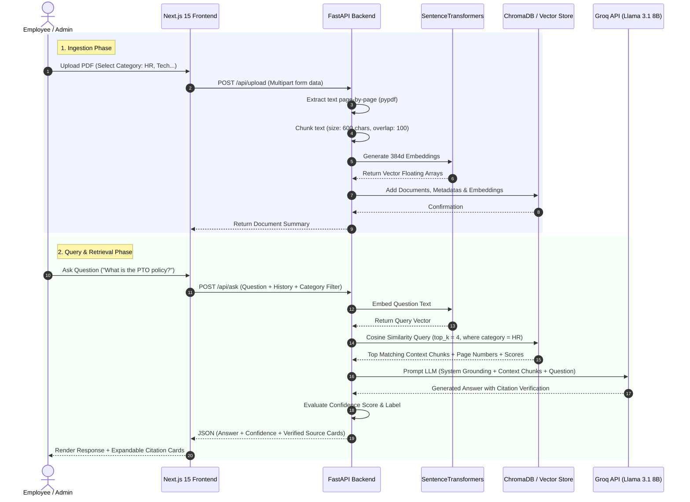

# DocMind System Architecture 🏛️

DocMind is designed as a modular, lightweight Retrieval-Augmented Generation (RAG) platform that enables enterprise teams to query internal PDF documents in natural language with source citation grounding.

---

## 📐 System Dataflow & Sequence Diagram

---

## 🛠️ Subsystem Responsibilities

### 1. Next.js 15 Frontend Layer
- **App Router (`app/`)**: Provides Server Side Rendering (SSR) and Client component isolation.
- **Tailwind Design System**: Custom glassmorphic dark theme, glowing indigo visual tokens, and responsive mobile-first views.
- **NextAuth.js**: Protects workspace routes (`/`, `/admin`) and handles user session state.
- **Client Components (`components/`)**:
  - `ChatWindow.tsx`: Manages multi-turn conversation state, category pill selection, prompt suggestions, and streaming responses.
  - `SourceCard.tsx`: Formats citation cards displaying filename, page number, similarity percentage, and chunk quotes.
  - `UploadPanel.tsx`: Handles PDF drag-and-drop file inputs, category selection, document indexing metrics, and deletion requests.

### 2. FastAPI Backend Layer
- **`main.py`**: Initializes ASGI app, handles CORS headers, mounts sub-routers, and provides `/health`.
- **`routes/chat.py`**: Exposes `POST /api/ask`. Coordinates query embedding, ChromaDB search, LLM generation, and response serialization.
- **`routes/documents.py`**: Exposes `POST /api/upload`, `GET /api/docs`, and `DELETE /api/doc/{id}`.
- **`services/embedder.py`**: Reads PDF bytes via `pypdf`, cleans whitespace, generates overlapping chunks with metadata (`doc_id`, `filename`, `category`, `page_number`, `chunk_index`), and embeds via `sentence-transformers` (`all-MiniLM-L6-v2`).
- **`services/retriever.py`**: Interfaces with persistent ChromaDB storage, executing cosine similarity search and category metadata filtering.
- **`services/llm.py`**: Formats grounding prompts for Groq (`llama-3.1-8b-instant`), enforces "I don't know" rules, and scores answer confidence.

---

## 🔒 Security & Data Isolation
- **Data Persistence**: Vector store data is isolated inside `backend/db/chroma` (or a dedicated `pgvector` container).
- **Zero Hallucination Grounding**: System prompts explicitly prevent LLM speculation outside retrieved chunks.
- **Network Boundaries**: In production, FastAPI API endpoints are restricted behind internal Docker network bridges or reverse proxies (Nginx / Hetzner VPS firewall).
